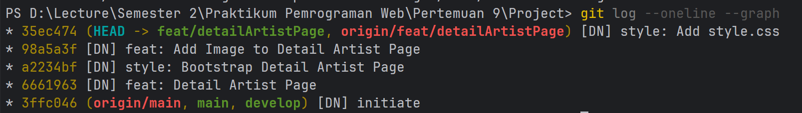

# praktikum-git-564274

# Dokumentasi Perintah Git

* `echo "# praktikum-git-25-564274-SV-26806" >> README.md`: Perintah untuk membuat file README.md dan menambahkan teks judul ke dalamnya.
* `git init`: Menginisialisasi repositori Git baru dan kosong di direktori saat ini agar Git dapat mulai melacak perubahan.
* `git branch -M main`: Mengubah nama branch utama (default branch) menjadi main, sesuai dengan standar konvensi GitHub saat ini.
* `git remote add origin https://github.com/...`: Menghubungkan repositori lokal dengan repositori jarak jauh (remote) di GitHub dan memberikan nama alias origin pada URL tersebut.
* `git add README.md` atau `git add .`: Menambahkan file README.md ke dalam staging area sebagai persiapan untuk proses commit, atau menggunakan `git add .` untuk memasukkan semua perubahan file di direktori saat ini ke dalam staging area sebagai persiapan sebelum disimpan.
* `git commit -m "[pesan commit]"`: Menyimpan perubahan dari staging area secara permanen ke riwayat repositori lokal. Perintah ini disertai dengan pesan commit yang mendeskripsikan fitur yang dikerjakan.
* `git push -u origin main` atau `git push -u origin <nama_branch>`: Mengunggah (push) commit dari branch lokal ke remote origin. Flag -u berfungsi mengatur tautan upstream antara branch lokal dan remote untuk mempermudah proses push dan pull selanjutnya.
* `git checkout -b <nama branch>`: Digunakan untuk membuat branch baru.
* `git branch`: Perintah untuk mengecek branch apa saja yang sudah dibuat.
* `git log oneline -graph`: Digunakan untuk mengecek commit yang sudah tercommit.
* `git rebase -i HEAD~3`: Command yang digunakan di mana HEAD 3 pada command tersebut menandakan akan menggabungkan 3 commit terakhir.
